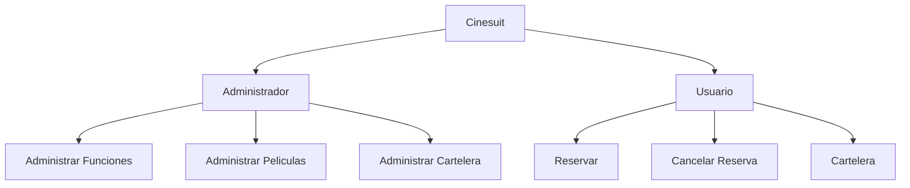

# Comidas The Rayo McQueen's 🌏🌐

## Tabla de contenido
| Indice | Título  |
|--|--|
| 1. | [Descripción](#Descripcion) |
| 2. | [Características](#Caracteristicas) |
| 3. | [Tecnologías Utilizadas](#Tecnologias) |
| 4. | [Uso del Repositorio](#Uso) |
| 5. | [Instrucciones de Ejecución](#Instrucciones) |
| 6. | [Mapa](#Mapa) |
| 7. | [Autora](#Autora) |

## Descripcion🚀

El proyectoThe Rayo McQueen's consiste en una página web de un negocio de comidas rápidas, en la página principal podemos ver una breve descripción de este negocio y un boton de .

## Caracteristicas🧮

1. **Admin** 👥: Permite registrar y añadir todo lo necesario que se necesita en la funcionalidad de cine

2. **Usuario** 🌐: Permite acceder a las peliculas y a la cartelera para realizar la reserva o cancelar la reserva

## Tecnologias🖥️

- **Python** 🐍: Todas la aplicacion esta hecha con python.

## Instrucciones📐

1. Clona el repositorio a tu máquina local. 
2. Configura adecuadamente todo lo adecuado drespecto a python.
3. Ejecuta el proyecto desde la terminal.

## Mapa 

## Autora👤
[Michelle Sánchez](https://github.com/miDaya02)
